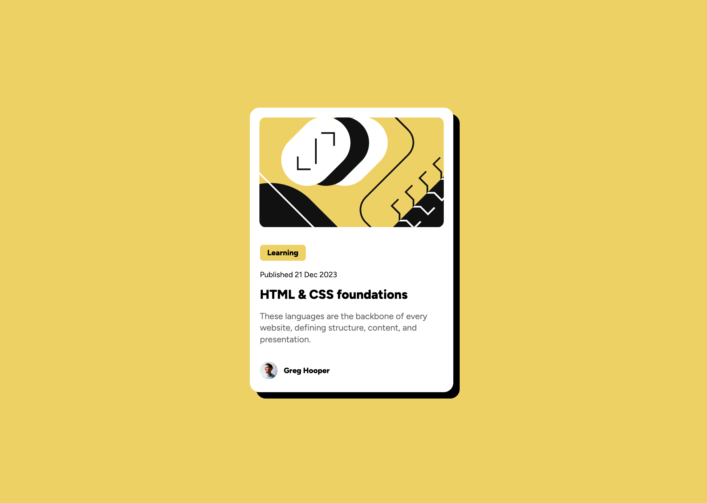

# Frontend Mentor - Blog preview card solution

This is a solution to the [Blog preview card challenge on Frontend Mentor](https://www.frontendmentor.io/challenges/blog-preview-card-ckPaj01IcS). Frontend Mentor challenges help you improve your coding skills by building realistic projects. 

## Table of contents

- [Overview](#overview)
  - [The challenge](#the-challenge)
  - [Screenshot](#screenshot)
  - [Links](#links)
- [My process](#my-process)
  - [Built with](#built-with)
  - [What I learned](#what-i-learned)
  - [Continued development](#continued-development)
- [Author](#author)

**Note: Delete this note and update the table of contents based on what sections you keep.**

## Overview

### The challenge

Users should be able to:

- See hover and focus states for all interactive elements on the page

### Screenshot

### Links

- Solution URL: [Github Solution](https://github.com/dilaraj/Blog-Preview-Card)
- Live Site URL: [Blog Preview Card](https://dilaraj.github.io/Blog-Preview-Card/)

## My process

### Built with

- Semantic HTML5 markup
- CSS custom properties
- Flexbox
- CSS Grid
- [React](https://reactjs.org/) - JS library
- React JS Components

### What I learned

This section helped me reinforce basics with React JS as well as CSS as I move toward strengthening my skills in React basics for master frontend development

### Continued development

I would like to:
  - Revisit flexbox - to reinforce my knowledge
  - Strengthen my knowledge on react concepts such as components and hooks

## Author

- Frontend Mentor - [@dilaraj](https://www.frontendmentor.io/profile/dilaraj)
- Github - [@dilaraj](https://github.com/dilaraj)
